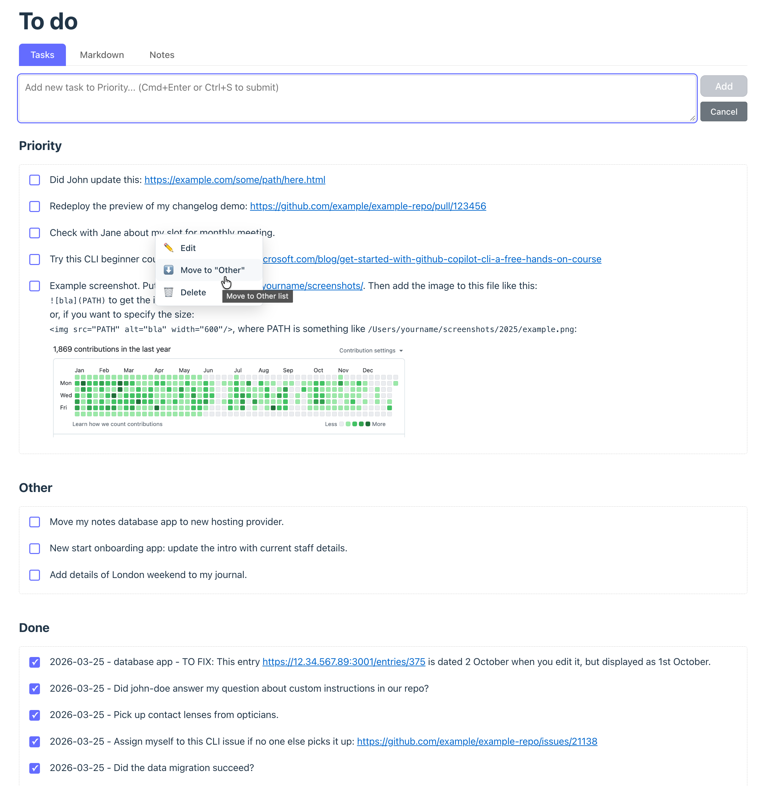

<!-- Don't panic! Copilot was here. -->
<!-- Oh sit down. Oh sit down. Sit down next to me! -->
<!-- Last edited by GitHub Copilot on 2026-07-01. -->
# Markdown-driven to-do list web app

A Vue 3 + Vite web application for managing to-do lists with markdown file synchronization. Edit tasks in the browser or directly in the markdown file - changes are reflected instantly in both places. It also includes a **Links** tab for keeping categorised bookmarks.



## Features

- ✅ **Markdown File Integration**: Read and write tasks from/to a markdown file
- ✅ **Three Task Categories**: Priority, Other, and Done
- ✅ **Quick Add**: Add tasks to Priority list with keyboard shortcuts (Cmd+Enter to submit)
- ✅ **Context Menu**: Double-click any task to Edit, Move, or Delete
- ✅ **Smart Editing**: Edit tasks in-place and they return to their original position
- ✅ **Drag and Drop**: Reorder tasks within Priority and Other lists
- ✅ **Complete Tasks**: Check items to move them to Done with date stamps
- ✅ **Move Between Lists**: Easily move tasks between Priority and Other
- ✅ **Live Sync**: External changes to the markdown file are automatically reflected in the app
- ✅ **Markdown Editor**: Built-in editor to directly edit the markdown content
- ✅ **Markdown Support**: Tasks can include links, formatting, and multi-line content
- ✅ **Links Tab**: Keep categorised bookmarks (Category, URL, Description) with URL validation, drag-and-drop between categories, and edit/delete
- ✅ **Accessible**: Keyboard navigation, ESC to dismiss menus, screen reader support
- ✅ **Responsive**: Works on desktop and mobile devices

## Getting started

### Prerequisites

- Node.js 16+ installed
- npm or yarn

### Installation

1. Clone the repository:
```bash
git clone https://github.com/hubwriter/todo-page.git
cd todo-page
```

2. Install dependencies:
```bash
npm install
```

### Configuration

The app stores tasks in a markdown file and links in a JSON file. There are three ways to configure the file locations (in order of priority):

#### Option 1: Configuration file (recommended)

Create a `config.json` file in the project root:

```bash
cp config.json.example config.json
```

Edit `config.json` to specify your desired file paths:

```json
{
  "todoFilePath": "/Users/yourname/path/to/todo.md",
  "linksFilePath": "/Users/yourname/path/to/links.json"
}
```

`linksFilePath` is optional; if omitted, the app stores links in a `links.json` file in the same folder as the todo file.

#### Option 2: Environment variable

Set the `TODO_FILE_PATH` environment variable (and optionally `LINKS_FILE_PATH`):

```bash
export TODO_FILE_PATH="/Users/yourname/path/to/todo.md"
export LINKS_FILE_PATH="/Users/yourname/path/to/links.json"
```

Or set it directly when running:

```bash
TODO_FILE_PATH="/Users/yourname/path/to/todo.md" npm run dev
```

#### Option 3: Default location

If no configuration is provided, the app uses `todo.md` in the project root directory, and stores links in `links.json` alongside the todo file.

**Note**: The `config.json` file is ignored by git, so you can safely store your personal file paths without committing them to the repository.

### Running the app

Start the development server:
```bash
npm run dev
```

This starts a single integrated server on http://localhost:3000 that includes:
- Express API backend for file operations
- Vite middleware for hot module replacement (HMR)
- Automatic file watching and live updates

Open http://localhost:3000 in your browser.

**Note**: The app now uses a single server on port 3000 (previously used two separate servers on ports 3001 and 5173).

### Building for production

```bash
npm run build
npm start
```

The built files will be in the `dist` directory and served by the Express server.

### Auto-start on login (macOS)

To automatically start the app when you log in:

1. A LaunchAgent plist file is provided at `/Users/alistair/Library/LaunchAgents/com.user.todo-app.plist`

2. Load the LaunchAgent:
```bash
launchctl bootstrap gui/$(id -u) ~/Library/LaunchAgents/com.user.todo-app.plist
```

3. To stop the auto-start service:
```bash
launchctl bootout gui/$(id -u)/com.user.todo-app
```

4. To check if it's running:
```bash
launchctl list | grep todo-app
```

The app will be available at http://localhost:3000 after login.

**Note**: Update the paths in the plist file if your Node.js installation or project location differs.

## Usage

### Adding tasks

1. Type a task in the input field at the top
2. Click "Add" or press **Cmd+Enter** (Mac) / **Ctrl+Enter** (Windows/Linux)
3. The task appears at the top of the Priority list
4. Changes are automatically saved to the markdown file

**Tip**: You can use markdown formatting in tasks, including links and multi-line content!

### Context menu (double-click)

Double-click any task to open a quick-action menu:

**Priority/Other Tasks:**
- ✏️ **Edit** - Edit the task in the input field (returns to original position when saved)
- ⬇️/⬆️ **Move to "Other"/"Priority"** - Move between lists (with automatic scrolling)
- 🗑️ **Delete** - Remove the task

**Done Tasks:**
- 🗑️ **Delete** - Remove the task

**Dismiss the menu**: Click anywhere outside the menu or press **ESC**

### Editing tasks

1. Double-click a task and select "Edit"
2. The task text appears in the input field at the top
3. Make your changes
4. Click "Save" or press **Cmd+Enter**
5. The task returns to its original position in the list
6. Click "Cancel" to discard changes and restore the original task

### Reordering tasks

1. Drag a task from Priority or Other
2. Drop it at the desired position
3. Changes are automatically saved

### Completing tasks

1. Check the checkbox next to a task in Priority or Other
2. The task moves to the top of Done with today's date
3. Changes are automatically saved

### Moving tasks between lists

**Using the context menu:**
1. Double-click a task
2. Select "Move to "Other"" or "Move to "Priority""
3. The browser scrolls to show the task in its new location

**Using checkboxes (Other → Priority only):**
1. Check the checkbox next to a task in Other
2. The task moves to the top of Priority (without a date)

### Editing markdown directly

1. Switch to the Markdown tab
2. Make your changes in the editor
3. Changes are automatically saved after you stop typing (1 second delay)
4. The task lists update to reflect your changes

### External edits

1. Open the markdown file in any text editor
2. Make changes and save
3. The web app automatically refreshes to show your changes

### Managing links

The **Links** tab keeps a categorised list of useful links.

1. Switch to the **Links** tab
2. Fill in the three fields:
   - **Category**: type a new category or pick an existing one from the dropdown (defaults to "GitHub")
   - **URL**: must be a valid link (if you omit the scheme, `https://` is added automatically)
   - **Description**: a short note (any line breaks are collapsed to a single line)
3. Click **Add** — the entry appears as a bullet under its category heading

**Edit or delete:** Double-click an entry to open a menu with Edit and Delete.

**Reorder or re-categorise:** Drag an entry to reorder it within a category, or drop it onto another category's box to move it there. A category disappears once its last entry is removed.

## Markdown format

The markdown file follows this structure:

```markdown
# Priority

- [ ] First priority task
- [ ] Second priority task

# Other

- [ ] Task that's not urgent
- [ ] Another task

# Done

- [x] 2025-10-16 - Completed task
- [x] 2025-10-15 - Another completed task
```

## Links file format

Links are stored in a JSON file (default: `links.json`, in the same folder as the todo file). Each category has a name and an ordered list of link entries:

```json
[
  {
    "name": "GitHub",
    "links": [
      { "id": "…", "url": "https://github.com/hubwriter/todo-page", "description": "The repository for this app" }
    ]
  }
]
```

## Technical stack

- **Frontend**: Vue 3 with Composition API
- **Build Tool**: Vite (integrated via middleware in development)
- **Backend**: Express.js (single server for both API and frontend)
- **File Watching**: Chokidar
- **Real-time Updates**: Server-Sent Events (SSE)
- **Markdown Parsing**: Marked.js
- **Storage**: Tasks in a markdown file; links in a JSON file

## Project structure

```
todo-page/
├── src/
│   ├── App.vue                 # Main component (tabs: Tasks, Markdown, Notes, Links)
│   ├── main.js                 # Application entry point
│   ├── style.css               # Global styles
│   ├── constants.js            # Shared constants and limits
│   ├── api/
│   │   ├── todoApi.js          # Task load/save + file-watch client
│   │   └── linksApi.js         # Links load/save client
│   ├── components/
│   │   ├── TaskList.vue        # Task list rendering
│   │   ├── ContextMenu.vue     # Task context menu
│   │   ├── LinksTab.vue        # Links tab (form, categories, menu)
│   │   ├── LinkList.vue        # A category's bullet list of links
│   │   └── LinkContextMenu.vue # Link edit/delete menu
│   ├── composables/
│   │   ├── useTasks.js         # Task state and operations
│   │   ├── useTaskEditor.js    # Task editing state
│   │   ├── useContextMenu.js   # Task context menu state
│   │   └── useLinks.js         # Links state and operations
│   └── utils/
│       ├── markdownUtils.js    # Markdown parse/generate + sanitise
│       ├── taskUtils.js        # Task list helpers (drag position, etc.)
│       └── linkUtils.js        # URL validation/normalisation + ids
├── server.js                   # Express backend (todo + links APIs)
├── server/
│   └── pathUtils.js            # Path validation helpers
├── index.html                  # HTML template
├── vite.config.js              # Vite configuration
└── package.json                # Dependencies and scripts
```

## License

See LICENSE file for details.
